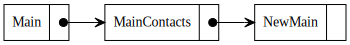
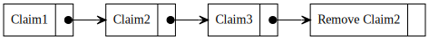

# SSB meta feed

Status: Design phase

Feeds in SSB are the main abstraction. It is possible to entangle
multiple feeds by referencing messages in other feeds, but otherwise
feeds are independent. Furthermore there is no concept of any kind of
metadata about a feed. This could be the lifetime of a feed, what the
feed is about, the format of the messages or other things people might
come up with.

Over time a number of different use cases for reasoning about how
multiple feeds relate to each other has come up. This includes same-as
where multiple devices have independent feeds, but can be seen as
belonging to the same physical person. Feed rotation for switching to
a newer feed format. Or the ablity to say something about a subset of
messages from a feed (a claim), that would enable partial replication
of those messages.

Another aspect of existing feeds in SSB is that they conflate the identity
of the feed together with the contents of the feed.

A meta feed is mainly meant to be used on a single device and is a
special kind of feed that only contains references and maintains
metadata about other feeds. As such it also has its own keypair that
defines its identity. Naturally a meta feed can also reference other
meta feeds and thus can be used to build a tree. The current state of
a meta feed, meaning what other feeds it references and their state,
is the reduced state of all changes on the feed. Because a meta feed
is just a series of messages they can be private or part of a group.

## Example of a meta feed

An example of a main feed referencing an ordinary feed and two meta
feeds. 


<details>
digraph metafeed {

  rankdir=RL
  node [shape=record];
  
  edge [tailclip=false];
  a [label="{ <ref> | <data> Main }"]
  b [label="{ <ref> | <data> MainContacts }"];
  c [label="{ <ref> | <data> NewMain }"];
  c:ref:b -> b:data [arrowhead=vee, arrowtail=dot, dir=both];
  b:ref:a -> a:data [arrowhead=vee, arrowtail=dot, dir=both];
}
</details>

Contents of messages in meta feed that acts as meta data for feeds:
```
Main: {type: add, feedtype: classic, id: @main}
MainContacts: {type: add, feedtype: bamboo, id:@mc, query: "type=contact,author=@main"}
NewMain: {type: add, feedtype: bamboo, id: @main2}
```

Type can be: `add`, `update`, `remove`

## Claims example

An example of the MainContacts meta feed with 3 claims from different
meta feeds about the same feed, with 1 claim removed so the final
state would be 2 claims. Removing Claim2 could be because the metafeed
stopped updating the feed for an extended period of time and thus
is not a good claim any longer.


<details>
digraph contacts {

  rankdir=RL
  nodesep=0.6
  node [shape=record];

  edge [tailclip=false];
  a [label="{ <ref> | <data> Claim1 }"]
  b [label="{ <ref> | <data> Claim2 }"];
  c [label="{ <ref> | <data> Claim3 }"];
  d [label="{ <ref> | <data> Remove Claim2 }"];
  d:ref:c -> c:data [arrowhead=vee, arrowtail=dot, dir=both];
  c:ref:b -> b:data [arrowhead=vee, arrowtail=dot, dir=both];
  b:ref:a -> a:data [arrowhead=vee, arrowtail=dot, dir=both];
}
</details>

Contents of messages:
```
Claim1: {type: add, feedtype: classic, id: @claim, query: "type=contact,author=@main"}
Claim2: {type: add, feedtype: classic, id: @other, metafeed: @MF2}
Claim3: {type: add, feedtype: bamboo, id: @third, metafeed: @MF3}
Remove Claim2: {type: remove, msgid: %idOfClaim2Msg }
```

Here Claim1 does not include a metafeed attribute as its from the same
meta feed. Notice Claim2 and Claim3 does not include any other
metadata than the feed type and a link to where the feed can be found
(id + metafeed). The feed type is for convenience, the canonical
location of metadata for a feed is in the metafeed it was posted.

While adding a new core abstraction to SSB can be seen as a big
change, we believe the abstraction adds enough expressive power to
make up for it's potential complications.

Once you start talking about multiple feeds that might relate to the
same thing (say contact messages of a feed) it would be natural that
these feeds only contain the hash of the messages not the message
itself. This cuts down the storage overhead and makes them easier to
check.

## Key management, identity and metadata

As mentioned earlier in classical SSB, the feed identity is the same
as the feed. Here instead we want to decouple the identity and
feeds. This means that the identity will be tied to an original
key. This key is used to generate all other keys in a deterministic
way using the method described in the [meeting
notes](./meeting-notes-arj-keks-2020-11-24). It is worth noting that
the method can be used to generate subkeys from derived keys. It was
considered to use [BIP32-Ed25519] but that method has a weaker
security model in the case of a key compromised where keys are shared
between devices.

The meeting notes also describes a method for reusing an existing
ed25519 key as the main feed on the meta feed.

If a key is reused in another part of the tree it should include a
reference to the original subfeed or metafeed it was defined in. The
original place is the authorative place for its metadata.

## Use cases

Let us see how we can use the above abstraction to solve several
common examples:

### New feed format

Changing to a new feed format could be implemented by adding a new
feed to the meta feed state, and by adding a message to the old feed
pointing to the new feed as the last message and assigning the new
feed as active in the meta feed.

In case of backwards compability with clients that does not support a
newer feed format or in the case of only wanting to support newer feed
formats, maintaining muliple feeds with the same content would be an
interesting avenue to explore. As the hash of the messages in the two
feeds would be different, there could be a way to include the hash of
the corresponding message in old feed in the newer feed.

Lower end clients could offload this extra storage requirement to
larger peers in the network.

### Claims

If one would like to replicate a specific part of a feed, such as the
contact messages, one could request another peer to generate a feed
that only references these messages. Then when exchanging data, the
original messages could be included as auxiliary data. This would only
act as a claim, never as a proof that some messages were not left
out. Naturally this comes down to trust then. Using the friend graph
would be natural, as would having multiple author staking claims and
entangling them.

### Sub feeds

Similar to claims it would be possible to create sub feeds that would
only contain certain messages. This might be useful for specific
apps. Another use case for this would be curated content, where
specific messages are picked out that might be of particular interest
to a certain application or specific people, or say messages within
the last year.

### Ephemeral feeds

Using the metadata it would be possible to attach a lifetime to feeds,
meaning honest peers would delete the feeds after a specific time.

### Allow list

Similar to ephemeral feeds it would be possible to attach an allow
list to a feed and only distribute this feed to people on the allow
list. As with ephemeral feeds, this cannot be enforced, but assuming
honest peers would give piece of mind that the data is only stored on
a certain subset of the whole network. This can naturally be combined
with private groups to better ensure safety.

### Same-as

While there are different ways to solve the problem of multiple feeds
belonging to the same physical person. We are going to sketch two
possible solutions here in very broad terms.

One solution would be to derive a key for each device from the main
key and transfer those to the devices out of band. Or to simply
collect the device ids. In any case, the main feed would maintain a
subfeed with all the devices listed. The main feed would then be
authorative of which devices constitute same-as.

Another option would be to have each device maintain a list of other keys
they consider same-as. If they are all in agreement the feeds would be
considered the same.

## Open questions

- In the case of claims, how are bad actors handled?
- What are the broader consequences of ephemeral feeds. Maybe they can
only be used in limited circumstances, and if so which ones?
- For sub feeds and feed rotation what is the best way to handle
  potentially overlapping messages

## Acknowledgments and prior work

CFT suggested the use of meta feeds
[in](https://github.com/arj03/ssb-observables/issues/1)

[BIP32-Ed25519]: https://github.com/wallet-io/bip32-ed25519/blob/master/doc/Ed25519_BIP.pdf
