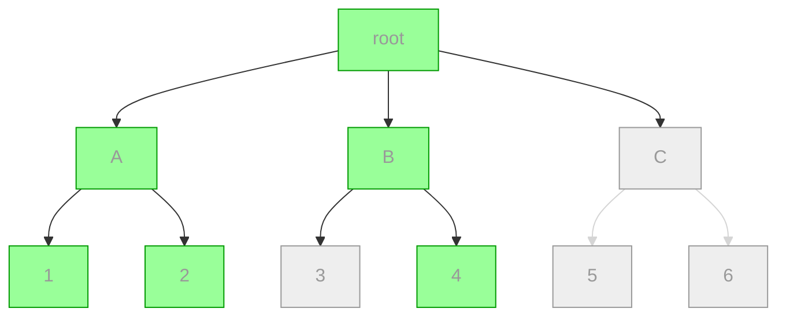
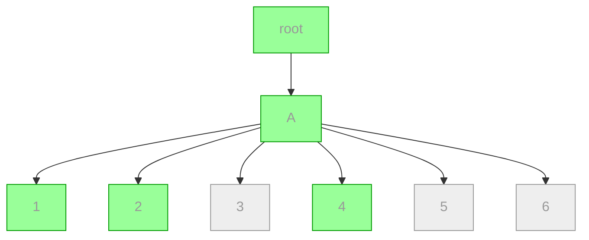
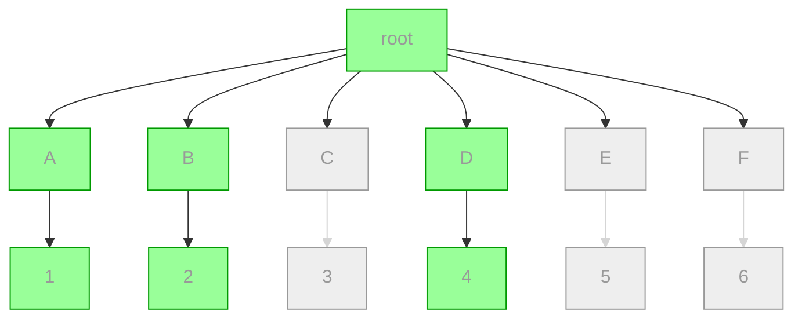

# Sharding math

## Abstract

In the tree of metafeeds, sharding is a technique of using intermediate nodes in the tree to group the leaf nodes into clusters. Peers who replicate a portion of the metafeed tree are thus not forced to know about all leaf feeds.

However, what is the optimal sharding ratio - one that minimizes unnecessary replicated messages and feeds?

## Definitions

Let $Feeds$ be the total number of content feeds, and $Feeds'$ be the number of content feeds which the current peer is going to replicate. $Feeds' \leq Feeds$.

Let $Shards$ be the number of shard feeds, and $Shards'$ the number of shard feeds the current peer is going to replicate.

$Replicating$ refers to the number of feeds (either content feeds or metafeeds) in the tree that are replicated.

$Overhead$ is the total number of metafeed messages replicated. It includes messages from the root metafeed and from the shard metafeeds. Does not include messages from content feeds.

If we replicate a shard feed, we say that we become *aware* of a content feed via the message on the shard feed declaring the content feed.

$Awareness$ is the total number of content feeds that we become aware of by replicating shard feeds.

## Theorem 1

$Replicating = Feeds' + Shards' + 1$.

**Proof:** the root metafeed is always replicated, thus it counts as $1$. By definition, the only other types of feeds are content feeds and shard feeds, of which the ones we are replicating are $Feeds'$ and $Shards'$, respectively. ∎

## Theorem 2

$Overhead = Shards + Awareness$.

**Proof:** we always replicate the root metafeed, which means we fetch all of its messages. Since the root metafeed only announces the existence of shard feeds, the number of messages in the root metafeed is $Shards$.

The other type of metafeed that we replicate are shard feeds. By definition, $Awareness$ is the number of content feeds under the shard feeds that we're replicating. Since shard feeds only announce the existence of content feeds, the number of messages in a shard correspond to the number of content feeds under that shard.

Overhead are the total number of metafeed messages, thus metafeed messages from the root ($Shards$) plus metafeed messages from all shards ($Awareness$). ∎

## Case studies

### Average sharding

| $Feeds=6$ | $Feeds'=3$ | | $Shards=3$ | $Shards'=2$
|-|-|-|-|-|



- $Replicating = 6$
- $Awareness = 4$
- $Overhead = 7$

## Min sharding

| $Feeds=6$ | $Feeds'=3$ | | $Shards=1$ | $Shards'=1$ |
|-|-|-|-|-|



- $Awareness = 6$
- $Replicating = 3 + 1 + 1 = 5$
- $Overhead = 1 + 6 = 7$

In the general case, min sharding has:

| Formula | Conclusion |
|--|--|
| $Replicating = Feeds' + 2$ | :slightly_smiling_face: |
| $Awareness = Feeds$ | :neutral_face: |
| $Overhead = Feeds + 1$ | :grimacing: |

Min sharding minimizes $Shards$ but **maximizes** $Awareness$ which leaves us with an overall large $Overhead$.

## Max sharding

| $Feeds=6$ | $Feeds'=3$ |
|-|-|
| $Shards=Feeds=6$ | $Shards'=Feeds'=3$ |



- $Awareness = 3$
- $Replicating = 3 + 3 + 1 = 7$
- $Overhead = 6 + 3 = 9$

In the general case, max sharding has:

| Formula | Conclusion |
|--|--|
| $Replicating = 2×Feeds + 1$ | :grimacing: |
| $Awareness = Feeds'$ | :slightly_smiling_face: |
| $Overhead = Feeds + Feeds'$ | :grimacing: |

Max sharding minimizes $Awareness$ but **maximizes** $Shards$ which leaves us with an overall large $Overhead$.

## Scenario: $Shards < Feeds'$

Because $Shards' \leq Shards$, it follows that $Shards' \leq Feeds'$.

So

$$
Replicating = Feeds' + Shards' + 1
$$

becomes

$$
Replicating \leq 2×Feeds' + 1
$$

which means that $Replicating = O(Feeds')$.

Further,  because $Shards < Feeds'$

$$
\frac{Feeds'}{Shards} > 1
$$

This means an **even distribution of feeds across shards** is highly likely to cause $Awareness = Feeds$, which leads to a large $Overhead$.

## Scenario: $Shards > Feeds'$

?

## Realistic case with 16 shards (4-bit)

| $Feeds=128$ | $Feeds'=32$ | $Shards=16$ |
|-|-|-|

It's reasonable to assume that one user has a dozens of apps, and up to a hundred private groups. Let's set $Feeds$ at 128, as a convenient power of two. Let's set $Feeds'$ at 32, which means a few apps and a few dozen groups.

Because we have 16 shards and 128 feeds, there are on average 8 feeds in each shard (assuming random shard allocation). $\alpha = \frac{Feeds}{Shards} = 8$

Because we have 32 feeds-to-replicate and 16 shards, there are on average 2 chosen feeds in each shard. $\alpha' = \frac{Feeds'}{Shards} = 2$. Sometimes there are 0 chosen feeds in a shard. So let's assume $Shards' = 14$.

This means:

| Formula |  |  | Conclusion |
|--|--|--|-|
| $Replicating =$ | $Feeds' + 14 + 1 =$ | $47$ | :slightly_smiling_face: |
| $Awareness =$ | $Shards'×\alpha =$ | $112$ | :neutral_face: |
| $Overhead =$ | $Shards + 112 =$ | $128$ | :grimacing: |

## Realistic case with 64 shards (6-bit)

| $Feeds=128$ | $Feeds'=32$ | $Shards=64$ |
|-|-|-|

$\alpha = 2$

$\alpha' = 0.5$

$Shards' \leq 0.5×Shards = 32$

This means:

| Formula |  |  | Conclusion |
|--|--|--|-|
| $Replicating \leq$ | $32 + 32 + 1 =$ | $65$ | :slightly_smiling_face: |
| $Awareness \leq$ | $Shards' × \alpha =$ | $64$ | :slightly_smiling_face: |
| $Overhead \leq$ | $Shards + 64 =$ | $128$ | :neutral_face: |

## Realistic case with 32 shards (5-bit)

| $Feeds=512$ | $Feeds'=64$ | $Shards=32$ |
|-|-|-|

$\alpha = 16$

$\alpha' = 2$

$Shards'  \approx  Shards$

This means:

| Formula |  |  | Conclusion |
|--|--|--|-|
| $Replicating \approx$ | $64 + 32 + 1 =$ | $97$ | :slightly_smiling_face: |
| $Awareness \approx$ | $Shards'×\alpha =$ | $512$ | :grimacing: |
| $Overhead \approx$ | $Shards + 512 =$ | $544$ | :grimacing: |

## Realistic case with 64 shards (6-bit)

| $Feeds=512$ | $Feeds'=64$ | $Shards=64$ |
|-|-|-|

$\alpha = 8$

$\alpha' = 1$

$Shards' \leq Shards$

This means:

| Formula |  |  | Conclusion |
|--|--|--|-|
| $Replicating \leq$ | $64 + 64 + 1 =$ | $129$ | :slightly_smiling_face: |
| $Awareness \approx$ | $64×\alpha =$ | $64$ | :slightly_smiling_face: |
| $Overhead \leq$ | $Shards + 64 =$ | $128$ | :slightly_smiling_face: |


## Realistic case with 128 shards (7-bit)

| $Feeds=512$ | $Feeds'=64$ | $Shards=128$ |
|-|-|-|

$\alpha = 4$

$\alpha' = 0.5$

$Shards' \leq 0.5×128 = 64$

This means:

| Formula |  |  | Conclusion |
|--|--|--|-|
| $Replicating \leq$ | $64 + 64 + 1 =$ | $129$ | :slightly_smiling_face: |
| $Awareness \leq$ | $Shards'×\alpha =$ | $256$ | :slightly_smiling_face: |
| $Overhead \leq$ | $Shards + 256 =$ | $384$ | :neutral_face: |

## Realistic case with 256 shards (8-bit)

| $Feeds=512$ | $Feeds'=64$ | $Shards=256$ |
|-|-|-|

$\alpha = 2$

$\alpha' = 0.25$

$Shards' \leq \alpha'×Shards = 0.25×256 = 64$

This means:

| Formula |  |  | Conclusion |
|--|--|--|-|
| $Replicating \leq$ | 64 + 64 + 1 =$ | $129$ | :slightly_smiling_face: |
| $Awareness \leq$ | $Shards'×\alpha =$ | $128$ | :slightly_smiling_face: |
| $Overhead \leq$ | $Shards + 128 =$ | $384$ | :neutral_face: |


## Realistic case with 48 shards

| Feeds=128 | Chosen=32 | Shards=48 |
|-|-|-|

2.666 feeds in each shard. Sometimes empty shards.

0.666 chosen feeds in each shard. We only replicate approximately 32 shards.

This means:

| Attribute | Formula |  |
|--|--|--|
| Replicating | Chosen + 32 + 1 = 65 | :neutral_face: |
| Overhead | Shards + 2.666×32 = 131 | :grimacing: |
| Awareness | 2.666×32 = 85 | :neutral_face: |


## Realistic case with 8 shards (3-bit)

| M=512 | N=64 | S=8 |
|-------|------|-----|

It's reasonable to assume there are dozens of apps and hundreds of private groups. Let's set M at 512, just to have a power of two. Let's see N at 64, which means a few apps and a couple groups.

Because we have 8 shards and 512 feeds, there are on average 64 feeds in each shard (assuming random shard allocation).

Because we have 64 feeds-to-replicate and 8 shards, there are on average 8 feeds-to-replicate in each shard, and we use all 8 shards.

This means:

| Attribute | Formula |  |
|--|--|--|
| Replicating | N+S+1 = 73 | :slightly_smiling_face: |
| Overhead | M+S = 520 | :grimacing: :fire: |
| Awareness | M = 512 | :grimacing: |

## Realistic case with 16 shards (4-bit)

| M=512 | N=64 | S=16 |
|-------|------|------|

There are on average 32 feeds in each shard (assuming random shard allocation).

There are on average 4 feeds-to-replicate in each shard, and we *probably* use all 16 shards.

This means:

| Attribute | Formula |  |
|--|--|--|
| Replicating | N+S+1 = 81 | :slightly_smiling_face: |
| Overhead | M+S ~= 528 | :grimacing: :fire: |
| Awareness | M ~= 512 | :grimacing: |

## Realistic case with 256 shards (8-bit)

| M=512 | N=64 | S=256 |
|-------|------|-------|

There are on average 2 feeds in each shard (assuming random shard allocation). It's reasonable to assume that in some shards there will be 1 feed, while in other shards there will be **zero feeds**.

There are on average 0.25 feeds-to-replicate in each shard, so it's reasonable to assume that the number of shards we will replicate is S' = `0.25*256 = 64`

This means:

| Attribute | Formula |  |
|--|--|--|
| Replicating | N+S'+1 = 129 | :neutral_face: |
| Overhead | S+2S' ~= 192 | :neutral_face: |
| Awareness | 2S' = 128 | :slightly_smiling_face: |

## Realistic case with 64 shards (6-bit)

| M=512 | N=64 | S=64 |
|-------|------|------|

There are on average 8 feeds in each shard (assuming random shard allocation).

There are on average 1 feeds-to-replicate in each shard, and it's reasonable to assume that *sometimes* a shard has 2 feeds-to-replicate and sometimes a shard has none. So the number of shards we will replicate is S' < S. Let's guess S' = 58.

This means:

| Attribute | Formula |  |
|--|--|--|
| Replicating | N+S'+1 = 123 | :neutral_face: |
| Overhead | S+S' ~= 122 | :neutral_face: |
| Awareness | S' ~= 58 | :slightly_smiling_face: |


## Realistic Case: clumping

| $Feeds=128$ | $Feeds'=32$ | $Shards=16$ |
| --------- | --------- | --------- |

Assume Staltz has dozens of apps, and up to a hundred private groups. So lets set his $Feeds$ at 128, as a convenient power of two.

Mix wants to replicate some subset of those (he only uses a couple of apps, and isn't in the same groups as Staltz) - set $Feeds'$ at 32.

Let us assume that each Application/ group consists of 3 feeds, and it' "clumps" these into the same shard.

So we have 32 / 3 ~= 11 clumps

Expected number of groups 11 clumps would randomly land on with 16 shards:
```
 1
 2
 3
 4
 5 ✓
 6 ✓✓✓✓✓✓✓
 7 ✓✓✓✓✓✓✓✓✓✓✓✓✓✓✓✓✓✓✓✓✓✓✓✓✓✓✓
 8 ✓✓✓✓✓✓✓✓✓✓✓✓✓✓✓✓✓✓✓✓✓✓✓✓✓✓✓✓✓✓✓✓✓✓✓✓✓✓✓✓✓✓✓✓✓
 9 ✓✓✓✓✓✓✓✓✓✓✓✓✓✓✓✓✓✓✓✓✓✓✓✓✓✓✓✓✓✓✓✓✓
10 ✓✓✓✓✓✓✓✓✓✓✓
11 ✓✓
12
13
14
15
16
```
<details>
  <summary>
    (see code)

  </summary>

```javascript
const shards = 16
const clumps = 11

const shardsUsedCount = {}

for (let i = 0; i < 1000; i++) {
  const shardsPicked = new Set()
  for (let c = 0; c < clumps; c++) {
    const shardPick = Math.floor((Math.random() * shards)) + 1
    shardsPicked.add(shardPick)
  }

  if (!shardsUsedCount[shardsPicked.size]) shardsUsedCount[shardsPicked.size] = 0
  shardsUsedCount[shardsPicked.size]++
}

for (let s = 1; s <= shards; s++) {
  const count = Math.round((shardsUsedCount[s] || 0) / 6)
  console.log(
    s.toString().padStart(2),
    new Array(count).fill('✓').join('')
  )
}
```
</details>


So, about 8 of our shards need replicating (half in this case).
Which means our Total Awareness is at about 50%, which seems great!

If each app is a clump of 2 feeds on average, we need to replicate 10/16 shards ~= 60%

- $Shards'=8$
- $\alpha = 8$
- $\alpha' = 2$
- $Replicating = 32 + 8 + 1 = 41$
- $Awareness = Shards'×\alpha = 8×8 = 64$
- $Overhead = Shards + 64 = 80$

## Conclusion

It's important to minimize both $Replicating$ and $Overhead$. But $Overhead$ is directly proportional to $Awareness$, which means we must minimize $Awareness$. We know that $Awareness$ is at its lowest when $Shards$ is at its highest, but $Overhead$ is also directly proportional to $Shards$, so we must minimize $Shards$ too.

Maybe we should aim for $Feeds' < Shards < Feeds$ as a general rule?

$Shards = 1 < Feeds' < Feeds$ is **min sharding** where the overhead is O(M) which is pretty bad. The "realistic case $Shards=8$" is not min sharding, but it is quite close to min sharding because $Shards < Feeds' < Feeds$, and overhead is pretty bad.

On the other hand, $Feeds' < Shards = Feeds$ is **max sharding**, and the result is even worse, we end up with $O(Feeds+Feeds')$ overhead and $O(2×Feeds')$ feeds to replicate.

$Shards = Feeds' < Feeds$ is somewhat an optimal situation ("realistic case `S=64`") but it quickly becomes $Shards < Feeds'$ when $Feeds'$ increases over time (e.g. joining new groups).

So we want $Shards$ to be greater than $Feeds'$, but *significantly* smaller than $Feeds$. Thus $Feeds' < Shards < Feeds$.

However, if we have clumping and noticing that $Shards = Feeds'$ is an optimal solution, we might have low overhead after all if $Shards < Feeds'$, as long as we avoid min sharding.
